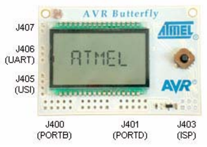

Butterfly Response-Time Tester (version 4)
==============================

The BRTT is a 3-channel latency tester for 5V devices, developed for use in the exercises in TTK4147.

This is the guide for BRTT with v4 firmware. For older versions, consult [older versions documentation](./brtt-documentation/ButterflyReal-TimeTester-v3.pdf).

The response time is a measure of the time it takes a device to respond to an incoming pin change (*from* the BRTT) with a pin change of its own (*to* the BRTT). Since the BRTT is external to the device being tested, it will not add any disturbances like a self-test would (like from extra CPU usage), and also measures any hardware-level pin I/O delays. 

The BRTT can test up to three independent channels, where each channel is a pair of *test* and *response* pins. It can also perform several tests in rapid succession, and reports all results as text over a serial port.

<figure>

<figcaption aria-hidden="true">BRTT Ports.</figcaption>
</figure>

Hardware
--------

**Port B** on the butterfly (bottom left) is used for the response-time test. 

| | |  |  |  |
| --- | --- | --- | --- | --- |
| 1 | 3 | 5 | unused | VCC |
| 0 | 2 | 4 | unused | GND |

The 6 numbered pins can be configured in several ways as either response or test pins, with any combination of the three channels, and with either active high or low. By default, the following layout is used, with active low:

| | |  |  |  |
| --- | --- | --- | --- | --- |
| Resp A | Resp B | Resp C | unused | VCC |
| Test A | Test B | Test C | unused | GND |

The two unused pins are wired to the joystick, and should either not be connected or left as an input on the device being tested.

*Pin 5 is connected to the piezoelectric speaker on the Butterfly, which means you will hear a clicking sound when using this pin in a test.*

### Menu

The menu is navigated with the joystick. Right opens, left closes, and up/down cycle through menus or options. Opening a menu will also set the currently shown option. Settings are *not* saved to the device when it is powered down.

### Testing and results

To start a test, open the main `BRTTv4` menu, or click the joystick down when in any menu page.

If the device fails to respond quickly enough, the internal timer on the Butterfly will overflow, and the remainder of the test will be aborted. 

### Serial port settings

| Baud rate | 9600  |
|----------:|:------|
| Data bits | 8     |
| Stop bits | 1     |
| Parity    | none  |

The three serial port pins are found to the left of the display.

| RX    |
|:------|
| TX    |
| GND   |

BRTT configuration
------------------

### Channel selection (`CHNNLS`)

Selects which of the A, B, and/or C channels are used for the test. 

 - `C + B + A` (all three channels)
 - `A` (only channel A)
 - `OTHER`
   - `B + A`
   - `C + B`
   - `C`
   - `B`
   - `C + A`
   
Default: `C + B + A` 
   
### Number of sub-tests (`NUMBER`)

Sets the number of sub-tests that are performed in sequence. This sequence can not be aborted once started (other than by making the device fail to respond, thus causing a timeout).

 - `50`
 - `250`
 - `1000`
 - `10000`
 - `1`
 - `5`
 - `10`
 
Default: `5`

### Advanced configuration (`CONFIG`)

#### Channel start trigger (`START`)

Sets whether the test pins trigger at the same time, or in a staggered sequence.

 - `STGGRD`: Test pins are triggered in a staggered sequence, and in a random order
 - `SIMULT`: All test pins are triggered simultaneously

Default: `Staggered`

#### Test pin unset timing (`UNSET`)

Sets when the test pin state is restored.

 - `IMMEDI`: Test pin state is restored immediately after the corresponding response pin receives a response
 - `COMBND`: Test pin states are restored only when all response pins have received their reponses
 
Default: `Immediate`

#### Pin IO method (`METHOD`)

Sets either polling or interrupt pin IO mode.

 - `POLL`: Response pins are read (and test pins set) in a tight loop.
 - `INTRPT`: Response pins are read with a pin change interrupt, and test pins are set with a timer interrupt.
 
Default: `Poll`

*In interrupt mode with staggered start trigger, there is a minimum interval of about 19 microseconds between two test pins being set.*

#### Timer overflow timeout (`TMEOUT`)

Sets the maximum amount of time for the device to respond before timing out. This also has a tradeoff with temporal resolution.

 - `4194MS`:  Resolution 128 us
 - `1049MS`: Resolution 32 us
 - `262MS`: Resolution 8 us
 - `33MS`: Resolution ~6 us (poll) / 1 us (interrupt)
 - `4MS`: Resolution 6 us (poll) / 122 ns (interrupt) 
 
*Polling mode has a higher minimum resolution due to the cycle time of a single loop.*

#### Test/response pin selection (`PINSEL`)

Selects which pins to use as test or response pins.

Pins are ordered `543210` (as shown in the chapter on hardware). `R` is response pin, `T` is test pin.

 - `RTRTRT`: Channels: `CCBBAA`
 - `RRRTTT`: Channels: `CBACBA`
 - `TTTRRR`: Channels: `CBACBA`
 - `TRTRTR`: Channels: `CCBBAA`

#### Active low/high (`ACTIVE`)

Sets pin active state.

 - `LOW`: Test and response pins are active low (GND)
 - `HIGH`: Test and response pins are active high (VCC)
 
Default: `Low`

*Response pins must be set to the inactive state (default: inactive high) before performing the test.*